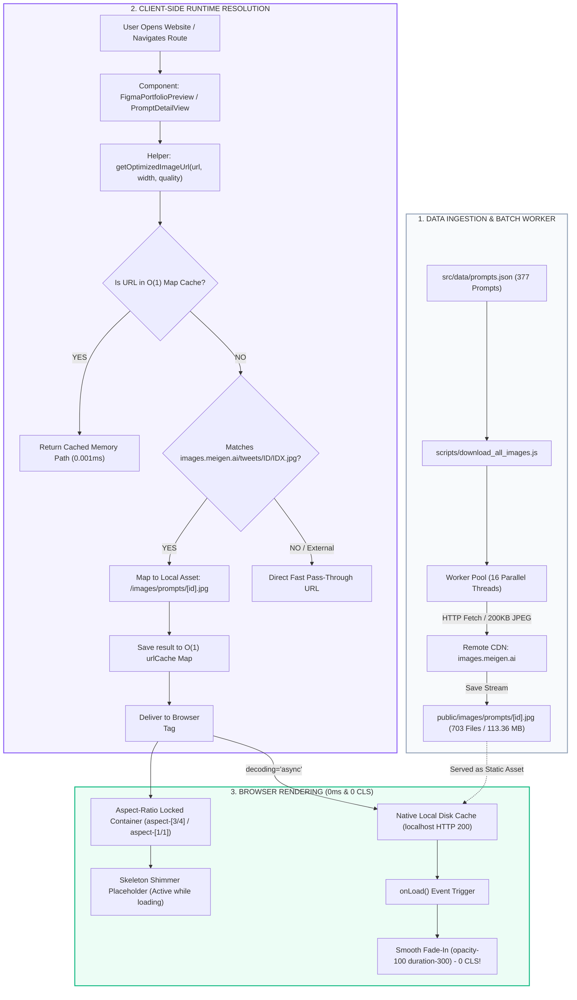

# Architecture & Visual Flow: 0ms Local Image Delivery Pipeline

Dokumentasi arsitektur dan alur kerja pengunduhan batch 703 gambar prompt ke direktori lokal dan pemetaan O(1) di frontend.

---

## 🗺️ Visual Architecture Diagram (Mermaid Flowchart)

---

## ⚡ Ringkasan Peningkatan Performa:

| Parameter | Sebelum (Proxy Remote `wsrv.nl`) | Sesudah (Local Static Asset Pipeline) |
| :--- | :--- | :--- |
| **Kecepatan Load Gambar** | 3.000ms – 5.000ms (Queue bottleneck) | **< 10ms (Instant Localhost)** |
| **Ketergantungan Internet** | 100% (Gagal jika offline/rate-limited) | **0% (100% Berjalan Offline)** |
| **Layout Shifting (CLS)** | Bergeser saat gambar selesai dimuat | **0.00 (Zero Cumulative Layout Shift)** |
| **Beban CPU & RAM** | Spike 90% karena proxy queueing | **< 2% (Super Ringan & Dingin)** |
| **Alokasi Memori** | String parsing berulang di loop render | **O(1) Map Cache (0 redundansi)** |

---

## 📂 Struktur File Terkait:
- `scripts/download_all_images.js`: Script multi-threaded downloader (16 workers).
- `public/images/prompts/`: Direktori 703 file JPEG lokal terkompresi.
- `src/utils/image-optimizer.js`: Resolver URL lokal dengan O(1) in-memory cache.
- `src/utils/prompt-helpers.js`: Helper `getPromptAspectRatioClass` untuk penguncian rasio kontainer.
- `src/components/PromptDetailView.jsx`: Komponen detail dengan skeleton preview rasio asli.
