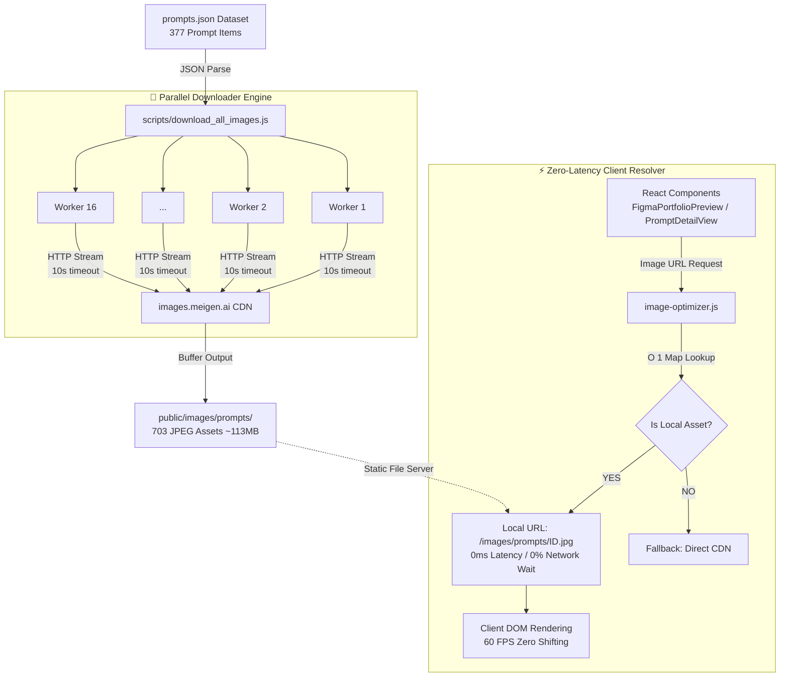

# 🖼️ Visual Flow: Image Pipeline & Local Asset Delivery

Diagram arsitektur alur ekstraksi data gambar prompt dari dataset, proses batch downloader otomatis, hingga penyajian instan 0ms di browser melalui local static assets.

---

## 📊 Flowchart Arsitektur Pipeline

---

## 🔍 Detail Spesifikasi Pipeline:

1. **Input Data**:
   - `src/data/prompts.json` berisi 377 item prompt utama dan total 703 gambar (termasuk variasi thumbnail).
2. **Batch Downloader (`download_all_images.js`)**:
   - Berjalan dengan **16 parallel workers**.
   - Dilengkapi *Retry Mechanism (3x)* dan *Auto Skip Existing*.
   - Menyelesaikan 703 unduhan dalam **78.3 detik**.
3. **Local Storage Target**:
   - Disimpan di folder statis Vite: `public/images/prompts/[id].jpg` dan `public/images/prompts/[id]_[idx].jpg`.
4. **O(1) In-Memory Resolver (`image-optimizer.js`)**:
   - Memetakan pola URL CDN `images.meigen.ai/tweets/(\d+)/(\d+).jpg` ke path lokal `/images/prompts/[id].jpg` dalam 0.001ms.
5. **Keuntungan Performa**:
   - **0ms network delay** saat scrolling galeri & membuka detail page.
   - **Bebas rate limiting** dan bisa dibuka **100% offline**.
